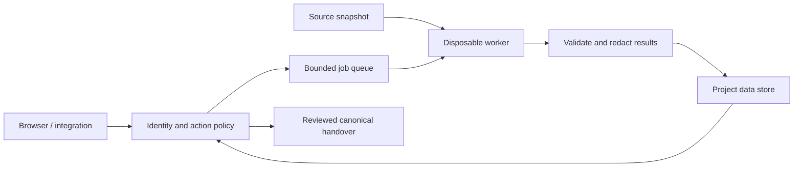

# Quality Studio review - 19 September 2026

Status: completed. The final source state passed the checks below. Changes are local and uncommitted.

Repository: C:/Projects/quality-studio, main, starting at a9c25aaf4cf94ce266f7a0dae7bd5f82a0c5977f. The checkout was initially clean. Review started at 20:30:27 UTC with a hard stop at 22:30:27 UTC. No commit, push, deployment, paid model review or external task handover was performed.

## Outcome

The review produced tested fixes for authorization, deterministic evidence integrity, subprocess handling and browser workflows. The application is still intended for repositories trusted by its operator. A shared service accepting hostile repositories needs an isolated execution boundary; bearer authentication and path checks alone do not provide one.

| Area | Verified problem and change |
| --- | --- |
| API authorization | A repository-scoped identity could register another repository using a trailing slash or uppercase route and actually changed the registry. Authorization now uses the matched route pattern. Import is checked before any outbound request. |
| Local browser boundary | Local mode now validates the request authority and browser Origin/Fetch Metadata before granting the local registrar identity. Allowed frontend origins remain exact, including custom ports injected by the development launcher. |
| HTTPS behind a proxy | Only explicitly listed proxy IPs can supply forwarded scheme/client address. Forwarded Host is excluded. Startup rejects framework-wide automatic forwarding, which otherwise bypasses the explicit allowlist. |
| Scanner processes | Concurrent pipe draining, a default 1,000,000-character limit per pipe, command deadlines and process-tree cleanup replace unlimited or silently truncated evidence. Overflow is unavailable, not clean. |
| Gitleaks evidence | Scan, version and supporting Git commands use the bounded runner. Missing, blank, malformed or invalid reports fail closed; report ingestion is capped at 8 MiB. Real invalid configuration previously looked clean. |
| Dependency evidence | Unknown audit shapes, invalid collections and npm exit 1 without usable findings are unavailable. Valid clean modern/legacy reports remain accepted. NuGet scans now include transitive packages; sensor version is 1.1.0. |
| SARIF imports | SARIF, Roslyn and ESLint reject failed, malformed or incomplete analysis evidence instead of reporting zero findings. Explicitly clean inline results and successful vendor-specific nonzero exit codes remain supported. |
| Windows npm/npx | The native process runner resolves npm and its bundled npx to Node plus the selected JavaScript CLI without a command shell. Explicit lockfile prefixes keep each audit in the selected package directory, including lock-only fixtures. |
| Git metadata | Nine read-only Git wrappers now disable repository-configured fsmonitor hooks and optional index refresh. Real harmless-hook fixtures proved execution before the fix and its absence afterward. |
| Review freshness | Source manifests are captured before prompt/sensor preparation and compared afterward. Request-supplied guidelines enter the effective policy hash. Findings cannot cite rules whose bodies were omitted by the prompt budget. |
| Boundary analysis | Unknown authorization is represented as unverified evidence, not proven anonymous access. Delegated process calls remain visible after moving scanner execution into the common runner. |
| Browser credentials | The bearer interceptor is restricted to normalized same-origin API URLs. It preserves unrelated credentials and does not react to unrelated 401 responses. This closes a missing boundary; no live token leak was demonstrated. |
| Browser workflows | Storage failures no longer break startup/navigation. Back/Forward preserves repository, file and finding state. Hosted exports now carry authentication and download non-executable Blob URLs with error handling and cleanup. |
| Dependencies | Four compatible transitive development-dependency updates remove the four npm advisories present at the start. No direct frontend dependency or coverage floor was lowered. |

The independent API audit inventories 104 endpoints. Additional real integration fixtures exercise foreign run IDs, export, compare, cancellation, pins, filtered collections and triage/handover path rejection. They found no further cross-repository bypass; the remaining dynamic-test gaps are listed in the coverage matrix.

## Detailed evidence

- [Backend correctness, freshness and boundaries](backend-review.md)
- [Git execution evidence and remaining lifecycle work](git-process-review.md)
- [Security findings, architecture and release gates](security-review.md)
- [API authorization inventory and coverage](security-api-authorization-matrix.md)
- [Operating profiles, worker contract and negative release gates](security-rollout.md)
- [Frontend regressions, browser evidence and audit results](frontend-review.md)
- [Exact Node 22.23.1 validation](node22/README.md)
- [Real API performance after Git hardening, with 1,600 source files](performance-final/README.md)
- [SARIF API evidence before and after the fix](sensor-report-audit/after/README.md)

## Security concept and next implementation steps

Keep the API as an identity and policy broker. It admits bounded jobs, then hands a selected immutable source snapshot to a disposable worker. The worker receives only a narrowly constructed environment and operation-specific credentials. Validate, limit and redact its output before persisting it in the selected project's store or presenting a handover for review.

1. **Hostile repositories: isolate execution before offering support.** A worker must not access another checkout, developer home, SSH agent, cloud credentials, host data directory or container socket. Enforce CPU, memory, process-count, disk, network and whole-job limits outside the process. A non-root API container is not sufficient. Gate this with harmless malicious-build fixtures that attempt forbidden reads, writes, egress and descendant survival.
2. **Complete process and output boundaries.** Several non-scanner Git wrappers still wait or buffer without finite limits. Use a shared bounded lifecycle with domain-appropriate failure semantics and interactive budgets. Scan generated review data as a distinct scope: the repository Gitleaks scan does not cover the relocated external data root. Test a planted synthetic secret across persistence, export and handover.
3. **Prepare shared hosting.** Separate read, review execution, triage, administration and handover permissions. Add credential IDs, expiry and live revocation; reserve per-client budget/concurrency before execution. Repository aliases can share a physical data root, so a registry ID alone is not a tenant boundary.
4. **Make handover authoritative.** Resolve canonical finding IDs/fingerprints on the server and show the exact outgoing task. Treat model prose as untrusted data. Downstream tool permissions must remain enforced independently of that prose.
5. **Finish browser and operations policy.** Choose a hosted session model and CSP together, restrict allowed iframe parents, cap/stream large reports, redact audit records and verify retention/restore procedures.

The [rollout matrix](security-rollout.md) defines three operating profiles, a minimal worker protocol and eight negative acceptance gates. The detailed concept includes primary-source references. It distinguishes implemented controls from proposed architecture; this review does not certify multi-tenant isolation.

## Validation scope and limitations

The consolidated measurements below include the last npm/npx source changes. Individual red/green reproductions remain in the linked reports; failed red logs intentionally demonstrate behavior before the fixes and are not unresolved final test failures.

Windows validation uses .NET 10.0.301 and Edge. Frontend tests and production build also ran with the exact pinned Node 22.23.1 from a checksum-verified portable official archive, in addition to the initially installed Node 24.18.0. The portable runtime and task-owned browser/API/frontend processes were removed or stopped.

The controlled tool-bound suites use local Git, Node, .NET and pinned Gitleaks; model/provider calls and outbound task creation are replaced by controlled test doubles. The explicit external-live lane was not run. Linux CI, Docker worker isolation and live provider behavior remain unverified here. The two machine-bound tests and browser timings are developer-machine observations, not evidence from the designated release-canary host.

Freshness manifest comparisons still do not provide an immutable snapshot guarantee: a temporary change reverted before the next comparison can escape detection. Boundary findings are mechanical review leads, not a count of confirmed exploitable vulnerabilities. Point-in-time dependency/secret scans likewise do not establish overall security.

## End-to-end sensor observations

The final dependency CLI run at 21:42:11 UTC is available and reports one High advisory:
semver 5.7.1 / GHSA-c2qf-rxjj-qqgw in the committed, deliberately vulnerable dependency test
fixture. Its exit code 1 reflects that finding. The same invocation previously stopped at npm
launch failure, then exposed npm selecting the wrong parent project; both before states are
preserved. This fixture finding is separate from the clean actual frontend and NuGet dependency
audits. See [final sensor output](dependencies-cli-final.json),
[Windows-launch failure](dependencies-cli-before.json) and
[parent-prefix failure](dependencies-cli-prefix-before.json).

The independent API recheck used a copied Release build containing the completed SARIF fix and isolated temporary data. All
seven previously false-clean SARIF cases now return unavailable; a valid clean report, a successful
tool run with vendor exit code 1, and a real inline finding remain supported. Coverage missing-data
cases still project unknown/null; they do not claim 100% coverage.

## Final validation

The final result counts and coverage measurements are recorded in [validation-summary.json](validation-summary.json) and
[coverage-summary.json](coverage-summary.json). In total, **774 distinct .NET tests passed**, with three POSIX-only skips on Windows; **215 frontend tests passed**. Repeated coverage runs are not counted as additional tests.

| Check | Result | Evidence |
| --- | --- | --- |
| Release solution build | 0 warnings, 0 errors | [Build log](build-final.log) |
| Portable lane | 456 Core + 82 API passed | [Log](portable-final.log) |
| Controlled tool-bound lane | 77 Core + 157 API passed; 3 POSIX-only skips | [Log](tool-bound-final.log) |
| Combined non-machine coverage | 533 Core + 239 API passed; Core 83.74%, API 51.38%; both above unchanged coverage floors | [Log](coverage-final.log), [gate](coverage-validation.log) |
| Two 5,000-file machine fixtures | Both passed locally | [Log](machine-local.log) |
| Frontend under pinned Node 22.23.1 | 215 passed, 74.88% line coverage | [Exact-runtime evidence](node22/README.md) |
| Frontend quality checks | Lint, 30 architecture/typography and 4 browser-resolver tests passed; production and reference builds passed | [Frontend report](frontend-review.md) |
| Repository checks | 30 tests plus 17 coverage-validator tests passed; rule/domain/catalogue checks passed | [Log](repository-checks-final.log) |
| Point-in-time dependency audits | Actual frontend production/full trees and both NuGet solution/spike reports have no known advisory | [Frontend full](frontend-npm-audit-after.json), [production](frontend-npm-audit-production-after.json), [NuGet solution](nuget-audit.json), [spike](nuget-spike-audit.json) |
| Formatting and package | dotnet format verification and Release NuGet pack passed | [Format log](format-check.log), [package log](pack-final.log) |
| Real API browser performance | All budgets passed after Git hardening: usable 93.3 / 192.5 / 177.9 ms, budget 500 ms | [Evidence](performance-final/README.md) |
| SARIF API regression | 16 isolated after-fix probes passed | [Evidence](sensor-report-audit/after/README.md) |
| Repository secret scan | Gitleaks 8.24.2 passed with no detected secrets in repository scope | [Log](security-cli-final.log) |

A final scanner hit identified a recorded build SHA-256 beside the API assembly name as a generic API key. The evidence now uses explicit artifact/sha256 fields; no scanner rule or allowlist was relaxed. The [original scan result](security-cli-releasehash-before.log) and [hash provenance comparison](release-hash-verification.json) are retained. The performance build precedes the final npx extension, as its report explicitly states.

The three skipped .NET cases exercise POSIX-only process fixtures on Windows. New Windows Node
fixtures separately cover pipe overflow and descendant cleanup. No existing test category or
coverage threshold was weakened to obtain these results. Raw coverage XML and generated fixture
data remain local and are excluded by this evidence directory's .gitignore.

The final independent source counter-review found no additional blocker in route authorization, local request trust or explicit proxy handling. It read the implementation and regression tests without rerunning or extending them. Task-owned services and temporary fixtures were shut down or removed; the isolated root CLI data directory was never created. Work stops with the prioritized remaining risks documented above.
