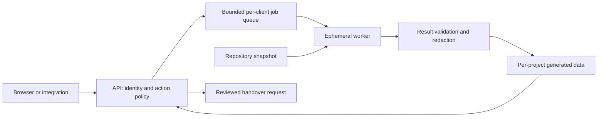

# Quality Studio security review, 2026-09-19

Reviewed baseline: `a9c25aaf4cf94ce266f7a0dae7bd5f82a0c5977f`, plus the changes made during this review. This is an evidence update to [the security decision dossier](../../docs/operations/security/index.html) and [the operational security concept](../../docs/operations/security-concept/index.html). Historical risk IDs R-01 through R-09 remain useful; their original descriptions and line numbers are not a current implementation inventory.

The practical boundary remains: operator-controlled repositories can be reviewed on the operator's host; hostile third-party repositories require isolated workers before they can be treated as supported. Repository authorization and path validation substantially help API access, but do not confine programs started in those repositories.

## What is implemented and verified

The baseline already has bearer authentication with hashed credentials and fixed-time comparison, repository access scopes, registrar-only registration/update/archive, host-owned analyzer profiles, loopback binding enforcement in Local mode, request/concurrency limits, file-response limits, and path/reparse-point checks. Review agents request read-only permission, although they still share the operator CLI context. These controls should be retained, not reimplemented.

This review found two distinct sensor output defects in `ProcessSensorCommandRunner`: default callers could accumulate up to `int.MaxValue` characters per pipe, and explicit limits silently discarded excess output while reporting the command's successful exit code. Silently missing diagnostics could present incomplete evidence as a clean scan.

The fix defaults to **1,000,000 characters per stdout/stderr pipe**. Exceeding either cap cancels the wait, kills the process tree, and returns `SecurityScannerUnavailableException`. Exactly-at-limit output remains intact. Neither excess output nor partial findings are returned as success. The existing five-minute command timeout remains independent.

Five new cases run real Node processes on Windows: default overflow, stdout overflow, stderr overflow, exact limits, and overflow cleanup of both parent and child processes. Before the fix, four failed and one passed. After the fix, the focused sensor suite has **24 passed, 0 failed, 3 skipped**; the skips are existing POSIX-only fixtures. The new cleanup test checks process identity and error semantics rather than a machine-speed threshold. See [structured evidence](security-sensor-output-evidence.json) and [raw final test output](security-sensor-regression-green.log).

The parallel application review confirmed a **P1 registrar authorization bypass**: repository-scoped Alice could send `POST /api/repos/` or `POST /API/REPOS/` and receive `201 Created`; the isolated registry was actually changed. ASP.NET matched the trailing-slash route while the security middleware compared the raw request path to `/api/repos`. The fix derives the operation from the matched endpoint route pattern so alternate route spellings receive the same registrar policy. The positive collection regression covers `/api/repos/` for a foreign-only identity. The route-based fix also removes the equivalent path-spelling inconsistency from report/quota collection checks; `/api/report/` and `/api/quotas/` were not separately tested in this review.

The parallel application review adds Local Host/Origin enforcement, trusted-proxy handling and frontend token-origin scoping. Their test evidence belongs to the corresponding review artifacts; the sensor suite above does not claim to verify them. The new Local request check was independently reviewed: authority/origin parsing rejects user-info, non-root paths, queries and fragments; a no-Origin/no-Fetch-Metadata request remains intentionally possible for non-browser local integrations. A foreign Referer fallback can add defense in depth for browsers missing those headers.

The independent API follow-up found a second forwarding boundary: `ASPNETCORE_FORWARDEDHEADERS_ENABLED=true` installs framework middleware before the application's explicit proxy middleware. Existing proxy tests reproduced two unauthorized scheme acceptances (HTTP requests became trusted HTTPS). A startup guard now rejects the final `ForwardedHeaders_Enabled` configuration key, covering the environment variable and equivalent configuration sources. Two new startup cases were red before the guard; the combined API security matrix then passed **68 tests**. See [bypass evidence](security-proxy-env-red-evidence.json), [red startup tests](security-proxy-startup-red.log), and [green API matrix](security-api-review-green.log). The framework behavior is explicit in [the .NET 10 startup filter](https://raw.githubusercontent.com/dotnet/aspnetcore/v10.0.0/src/DefaultBuilder/src/ForwardedHeadersStartupFilter.cs).

Gitleaks now uses the bounded runner for scanning, its supporting Git calls and version probes. Scans/Git calls have a five-minute deadline; version probes have a 30-second deadline. Both pipes are read concurrently and limited to 1,000,000 characters each. Reports have a separately enforced **8 MiB byte limit**, checked while reading as well as before allocation. Missing, blank, malformed and structurally invalid reports become unavailable; exit code 1 without findings also becomes unavailable. The original public constructor signatures remain available as delegating overloads for package binary compatibility. These deadlines apply per command, not to the aggregate staged-scan job. The report cap bounds application reading and parsing, not the bytes a scanner can write to disk before exiting; worker disk quotas remain necessary.

This closes a real false-clean case: pinned Gitleaks 8.24.2 produces exit 1 and no report for invalid TOML, while a successful clean scan produces exit 0 and `[]\n`. The old wrapper accepted both as clean. Five of six initial report-error regressions failed before the fix. Tests cover repository/range/staged Git-limit propagation, actual scanner config failure, actual planted-secret detection, report failures and stderr pipe pressure. [Initial red evidence](security-gitleaks-report-red.log); [final targeted suite](security-gitleaks-green.log) passed **24 tests, 0 failed, 0 skipped**. This fixes scanner process/report handling, not the separate generated-output scan-coverage gap below.

The parallel dependency review confirmed another false-clean class: empty/invalid npm or NuGet report shapes and fatal audit exits could become empty findings; transitive NuGet packages were not requested. Dependency sensor version **1.1.0** now validates report structure and exit semantics and includes transitive packages. Eleven of eighteen regressions were red before the fix; all **18 passed** afterward. [Before](dependency-schema-red.log), [after](dependency-schema-green.log). The Windows npm launch and explicit working-directory prefix were then corrected. The final real CLI scan at 21:42 UTC was available with npm 11.16.0 and dotnet 10.0.301, and detected the intentionally vulnerable semver 5.7.1 dependency in the test-fixture lockfile. This is a fixture finding, not a production dependency finding. [Raw result](dependencies-cli-final.json).

The late SARIF audit reproduced false-clean results for malformed result arrays, failed invocations, metadata-only/empty-run logs and unresolved external result files, including the shared Roslyn/ESLint importer. Version **1.1.0** requires usable inline analysis evidence and fails closed on explicit execution/configuration errors. Nonzero producer exit codes remain supported when execution is explicitly successful. The targeted suite changed from **21 failed / 14 passed** to **35 passed, 0 failed**; genuine Roslyn/ESLint findings and valid empty arrays remain supported. [Red evidence](security-sarif-red.log), [green evidence](security-sarif-green.log), [independent API reproduction before the fix](sensor-report-audit/README.md), [updated contract](../../docs/deterministic-analyzer-evidence.md#completed-sarif-scans).

The additional Hosted endpoint review inventoried **104 API routes** and added four passing integration tests for cross-repository reads, exports, compare, cancel/pause/resume, pins, triage and handover. No additional bypass was reproduced. The tests include a live fake-executor run, separate persisted report stores and a zero-call outbound tripwire. See the [authorization and coverage matrix](security-api-authorization-matrix.md), [route inventory](security-api-endpoint-inventory.json) and [raw test result](security-api-repository-boundaries.log).

A parallel fix now disables repository-configured fsmonitor hooks for the application-owned read-only Git wrappers using command-level `--no-optional-locks -c core.fsmonitor=false`. Three real-hook regressions changed from red to green, and 102 affected tests passed. See [red](backend-evidence/git-fsmonitor-red.trx), [green](backend-evidence/git-fsmonitor-green.trx) and [affected suites](backend-evidence/git-suites-green.trx). This closes the direct-wrapper hook reproduction below; it does not establish an OS sandbox or govern Git invoked internally by a third-party tool.

## Remaining prioritized findings

| Priority | Finding and evidence | Required next step |
| --- | --- | --- |
| P0 for hostile repositories | **Build and review execution still inherit host authority.** `DotNetBuildSensor.cs:81-98` invokes restore/build; `AngularCompilerSensor.cs:89-102` invokes repository-local JavaScript. `DependencyVulnerabilitySensor.cs:55-65` starts processes without environment isolation. `ReviewAgent.cs:167-176` uses the repository working directory and `ContextMode = "shared"`. Host-owned command strings do not make build definitions, analyzers, or CLI context trusted. | Worker isolation described below; no hostile-repository support until negative boundary tests pass. This continues R-01/R-02 and S1. |
| P1 | **Several non-scanner Git paths still bypass the hardened process runner.** `RepositoryHierarchyCache.cs:351-375`, `RepositoryHierarchyAdapters.cs:291-319`, and `Coverage.cs:583-603` use synchronous unbounded `ReadToEnd`/`WaitForExit`. `GitChangeSetProvider.cs:193-230` observes cancellation but lacks process-tree cleanup. The Gitleaks scan/version/supporting-Git paths were migrated in this review; tree/file/risk and change-review wrappers remain separate. | Consolidate subprocess lifecycle, concurrent pipe draining, finite output, deadlines and cleanup. Treat output truncation/invalid reports as unavailable. Add process-tree and stderr-pressure fixtures. |
| P1 for executable/tool-internal Git | **Repository-local Git configuration remains executable input outside the hardened direct wrappers.** An isolated test configured a harmless `core.fsmonitor` hook in a fresh working copy; metadata reads executed it before the command-level fix. [Original evidence](security-git-fsmonitor-evidence.json). Direct application wrappers now disable it; Git launched internally by external tools is a separate boundary. This requires control over local `.git/config`; normal remote commits alone do not grant it. | Keep sanitized Git configuration, disable external-diff/textconv where applicable, and run tool-internal Git inside the same worker boundary. [Follow-up analysis](git-process-review.md). |
| P1 | **External generated review output is outside the repository secret scan.** `ReviewMetaPath.cs:49-53,78-79` now stores reviews through `QualityDataRoot`, while `GitleaksSecurityScanner.cs:417,451-460` scans only `dir .` inside the repository. The configuration description and scanner documentation were corrected during this review to state the repository-only scope. A synthetic-only test with pinned Gitleaks 8.24.2 returned 0 findings for the clean checkout and 1 finding for its separate generated review directory. [Evidence](security-generated-output-scan-evidence.json). This reopens the scan-coverage part of historical F-04 after data migration; it is not evidence of an actual leaked credential. | Add generated-output secret scanning with a distinct scope/provenance, and output redaction before persistence/handover. Update the stale coverage statement and add a relocated-data-root regression. |
| P1 before shared hosting | **Repository membership currently grants broad actions, and credentials have no lifecycle.** `ApiSecurity.cs` builds a static client/hash list at startup and `ApiClientIdentity` offers repository membership plus registrar status, with no separate read/review/triage/handover permissions or expiry/revocation. | Add explicit action scopes, key IDs, expiry and live revocation; audit actor/repository/action/result. For browser users prefer an identity provider and server-held session credentials. |
| P1 | **Model prose remains instruction-bearing at handover.** `AgentStudioTaskClient.cs:136-157` embeds request-supplied finding text into the downstream task prompt. | Resolve canonical findings by ID/fingerprint server-side, give the operator the exact task preview, transmit evidence as structured untrusted data, and enforce downstream tool permissions independently. This continues R-05/S4. |

The process and Git findings are source-level and harmless-fixture findings, not a claim of demonstrated remote exploitation. The generated-output test exercises the actual scanner with the application's repository boundary, not the full API persistence path. No real secrets, user repositories, external handover, or paid model run were used for these tests.

The compact [operating-profile and acceptance matrix](security-rollout.md) makes the supported trust boundaries, next worker protocol and negative release gates explicit. These gates are proposed requirements, not implemented worker controls.

## Proposed security concept

Keep the API as a narrow broker. Split the data and authority flow into explicit compartments:

**API and admission.** Authenticate hosted clients on every API route, distinguish repository read from execution and handover, and reserve concurrency/budget before creating a job. Local mode remains an explicitly single-operator mode with validated loopback authority and browser origins. No worker receives API registrar tokens or the server registry.

**Worker.** Use a disposable container or VM and a dedicated identity. Mount only the selected source snapshot read-only; builds that require intermediate output use a disposable writable copy or overlay. Keep the host checkout, other repositories, generated-data store, developer home, SSH agents, cloud credentials and container socket inaccessible. Set memory, CPU, process-count, disk and wall-clock limits at the operating-system boundary, in addition to application output limits. A non-root API container alone is not worker isolation. OWASP recommends resource bounds and read-only filesystems for container hardening. [OWASP Docker Security](https://cheatsheetseries.owasp.org/cheatsheets/Docker_Security_Cheat_Sheet.html)

**Execution and egress.** Select immutable analyzer profiles and trusted tool binaries. Construct the child environment from an allowlist rather than inheriting the host environment. Give each worker a clean CLI home; allow only the provider or package endpoints required for its declared operation. Pass short-lived, operation-scoped credentials through a broker when supported. Treat MSBuild restore/build, ESLint configs and repository-local JavaScript as executable code. Microsoft's guidance explicitly treats unknown build logic as capable of arbitrary execution. [Microsoft MSBuild security](https://learn.microsoft.com/en-us/visualstudio/msbuild/msbuild-security-best-practices?view=visualstudio)

**Results and secrets.** Limit result bytes, JSON depth, finding counts and string lengths before parsing; validate schema, path, repository/run identity and provenance before writing. Persist only normalized results in the selected project's store. Secret detection must cover incoming source excerpts, model/sensor output, generated reports and outbound handover, with redacted audit records. A repository-only secret scan must report its scope rather than imply generated output was checked.

**Prompt injection.** Mark source/evidence as untrusted data and maintain randomized delimiters, but enforce privileges outside the model. The worker may still emit inaccurate or manipulated findings; schema validation, evidence attribution and a separate handover approval prevent those findings from becoming unrestricted actions. OWASP describes least-privilege tool access and independent validation as complementary controls. [OWASP prompt injection prevention](https://cheatsheetseries.owasp.org/cheatsheets/LLM_Prompt_Injection_Prevention_Cheat_Sheet.html)

**Hosted transport and browser.** Terminate TLS at a controlled edge and trust forwarded headers only from configured proxy IPs. Apply them before HTTPS/authentication decisions; do not accept arbitrary forwarded Host values. Keep the private backend port inaccessible from the public network. Test both trusted and spoofed `X-Forwarded-Proto`. Forwarded headers change request security context and therefore require an explicit trust boundary. [Microsoft proxy guidance](https://learn.microsoft.com/en-us/aspnet/core/host-and-deploy/proxy-load-balancer?view=aspnetcore-10.0)

**Operations.** Record actor, key ID, repository, run ID, worker image/tool versions, source revision, policy decision, budget reservation and terminal outcome. Do not log raw credentials, prompts or source text by default. Provide kill/revoke controls, bounded retention and restore testing. Label tenant isolation as unsupported until each customer's worker, data and credential boundaries are verified.

## Implementation order and release gates

1. **Immediate trusted-operator hardening:** land the tested request/token/output fixes; migrate the remaining Git wrappers to bounded subprocess handling; repair generated-output scan coverage. Gate: no silent partial-success scan, process cleanup proven, hostile browser request denied before work, output-store fixture detected.
2. **Worker boundary:** implement the disposable worker contract and scoped environment/egress. Gate: malicious build and prompt fixtures cannot read a marker outside the snapshot, reach another repository, use developer credentials, write the host checkout or contact a blocked endpoint. Kill/timeout must reclaim descendants and quota.
3. **Shared hosting:** add action scopes, credential lifecycle and fair per-client job limits. Gate: an identity for A cannot list/read/cancel/pin/compare/export runs from B; revocation takes effect without restart; one client cannot monopolize execution.
4. **Evidence and handover:** canonical finding references, secret-safe persistence/export and explicit task preview. Gate: manipulated model prose cannot grant extra tool actions; generated secret fixtures never appear in API responses, audit logs or handovers.

A Host/Origin check prevents browser-origin abuse, but is not authentication against a local process. Non-browser integrations intentionally remain supported in Local mode. OWASP distinguishes server-side Origin/Fetch-Metadata checks from browser CORS behavior. [OWASP CSRF prevention](https://cheatsheetseries.owasp.org/cheatsheets/Cross-Site_Request_Forgery_Prevention_Cheat_Sheet.html)

The Git reproduction follows the documented `core.fsmonitor` mechanism: the setting can name a hook command. That supports treating local Git configuration as executable input in the imported-working-copy threat model. [Git configuration reference](https://git-scm.com/docs/git-config#Documentation/git-config.txt-corefsmonitor)
